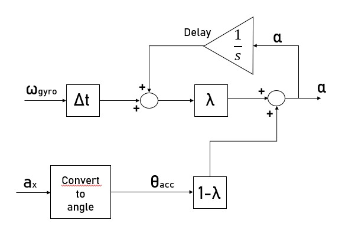

## IMU 3D Tracking: complementary filter approach

Goal of this repo is to implement IMU sensor fusion on real hardware (Arduino Uno R3) using the complementary filter.
The complementary filter combines data from both gyroscope and accelerometer applying first order HPF and LPF, respectively. 
The final result is an angular orientation output, which we can use to rotate a 3d-box made in JavaScript using the [p5.js](http://p5js.org/) library.

## How it works?

## Details
Inside the Arduino directory you can find the code used to implement complementary filter directly on hardware.
Roll, pitch and yaw are calculated and sent via serial communication to PC.
JavaScript code is used to generate and rotate the 3d-box, according to the stream of data incoming.
In order to build this project you need the [p5.serialApp](https://github.com/p5-serial/p5.serialcontrol/releases) made by Shawn Van Every to connect Arduino and the p5.js sketch.

