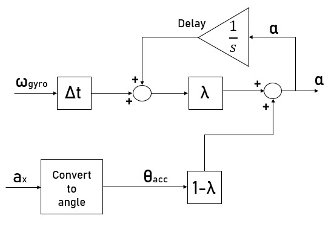

# IMU 3D Tracking: Complementary Filter Approach

Goal of this repo is to implement IMU sensor fusion on real hardware (Arduino Uno R3) using the complementary filter.
The complementary filter combines data from both gyroscope and accelerometer applying first order HPF and LPF, respectively. 
The final result is an angular orientation output, which we can use to rotate a 3d-box made in JavaScript using the [p5.js](http://p5js.org/) library.

### Hardware
- Arduino Uno
- 6-DOF MPU-6050 with GY-521

## How it works?
Complementary filtering consists of using low-pass and high-pass filters in a complementary way. The basic idea is to combine the long-term stability of the accelerometer and the short-term stability of the gyroscope: the accelerometer signal is filtered with a low-pass filter to limit the effects of vibrations; conversely, the gyroscope signal is filtered with a high-pass filter to reduce the effect of long-term drift.

### Insights
I made a small pdf file including a little bit of theory behind this project.
- [[ENG] Orientation Estimation using IMU]()
- [[ITA] Stima dell'orientamento utilizzando sistemi ineriziali IMU](Stima dell'orientamento tramite sensori IMU.pdf)

## Results
Here you can see the final result obtained. The box is really stable and responsive.
Since magnetometer is missing from the MPU-6050 module, it's impossible to retrieve a correct Z-axis rotation due to the lack of a fixed frame.
However, the yaw angle is calculated by the gyroscope anyway in order to show this issue. In the JavaScript file it is possible to enable rotation on the Z axis by uncommenting the corresponding line

  
 

## Details
Inside the Arduino directory you can find the code used to implement complementary filter directly on hardware.
Roll, pitch and yaw are calculated and sent via serial communication to PC.
JavaScript code is used to generate and rotate the 3d-box, according to the stream of data incoming.
In order to build this project you need the [p5.serialApp](https://github.com/p5-serial/p5.serialcontrol/releases) made by Shawn Van Every to connect Arduino and the p5.js sketch.

## References
- [MIT Lecture on Orientation Estimation](https://ocw.mit.edu/courses/aeronautics-and-astronautics/16-333-aircraft-stability-and-control-fall-2004/lecture-notes/lecture_15.pdf)

